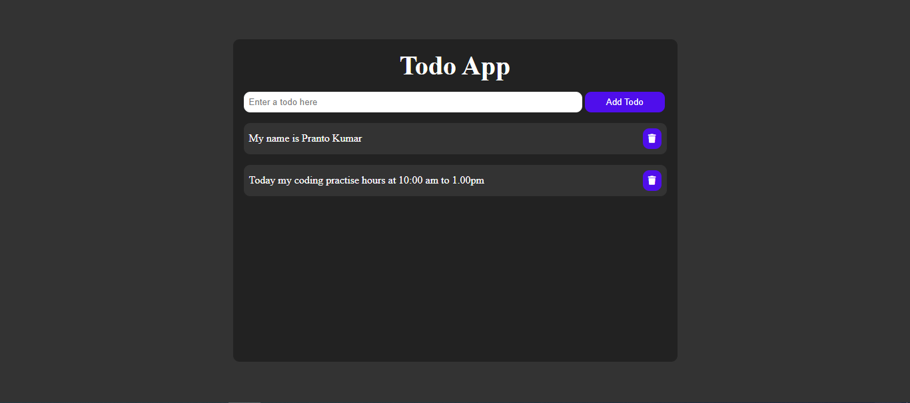

# To-Do list web applicaton 

A to-do list web application is a simple yet powerful tool for managing tasks. It typically involves : 

- **User Interface (UI) :**  It includes elements like input fields, lists, buttons, and possibly a calendar.

- **User Experience (UX) :** This focuses on how the user interacts with the application. It should be intuitive and easy to use.

- **Data Storage :** This is where the to-do items are saved. It can be local storage (for basic applications) .

- **Functionality :** This includes core features like adding and deleting. 

# Demo Preview
**You can see the live demo project please [Click Here](https://pranto113015.github.io/Js-Beginers_Project-4/)**



# Features

- **Task creation :** Allow users to add new tasks with descriptions.
- **Task deletion :** Provide a way to remove completed or unwanted tasks.


# Technologies Used

- **HTML, CSS, and JavaScript :** These are the core technologies for building web applications. They provide a solid foundation for creating a simple to-do list.

- **Local Storage :** This is a browser-based storage mechanism for storing data locally.


# Installation

### Prerequisites

- Code editor to open code (Example : vs code)
- Browser to run (Example : google chrome)

### Steps
If you run this project locally, then follow these steps below

1. Clone the Repository

   ```sh
   https://github.com/pranto113015/Js-Beginers_Project-4.git
   ```

2. Navigate to the Project Directory
3. Open the project by vs code applicaton
4. Click the run option of the menu bar and again click the start debugging or open with live server

Or you can do this way

1. Download the project
2. unzip file
3. open with your IDE such as vs code
4. open with live server

# Usage

- **Task Management :** Create, prioritize, and track tasks for work, school, or personal life.
- **Time Management :** Allocate time for different tasks and improve productivity.
- **Shopping Lists :** Create and share shopping lists with others. 

# Project Structure

For a simple todo list app using HTML, CSS, and JavaScript, a basic structure might look like this:
```sh
todo-app/
├── index.html
├── style.css
├── main.js
```

- **index.html:** Contains the HTML structure of the app, including the input field, button, and list to display tasks.
- **style.css:** Contains the CSS styles for the app's appearance.
- **script.js:** Contains the JavaScript logic for adding and removing tasks.

# Contributing

Contributions are what make the open-source community such an amazing place to be, learn, inspire, and create. Any contributions you make are greatly appreciated.Here are some ways you can get started:

- **Report bugs** : If you encounter any bugs, please let us know. Open up an issue and let us know the problem.
- **Contribute code** : If you are a developer and want to contribute, follow the instructions below to get started.
- **Suggestions** : If you don't want to code but have some awesome ideas, open up an issue explaining some updates or imporvements you would like to see.
- **Documentation** : If you see the need for some additional documentation, feel free to add some.

#### Instructions

1. Fork the Project
2. Create your Feature Branch

   ```sh
   $ git checkout -b feature/AmazingFeature
   ```

3. Commit your Changes

   ```sh
   git commit -m 'Add some AmazingFeature'
   ```

4. Push to the Branch
   ```sh
   git push origin feature/AmazingFeature
   ```
5. Open a Pull Request

# License

State the license under which your project is distributed.
This project is licensed under the MIT License - see the LICENSE file for details.

# Contact

If you have any questions or need further clarification, please contact my email/ Linkedin .
- **💌 Email : pranto113015@gmail.com**

- **🕵️‍♂️ Linkedin : [Pranto Kumar](https://www.linkedin.com/in/pranto-kumar-a326801b3/)**

# Acknowledgements

Online support made this project possible and 
Thank you for reviewing my project 💙